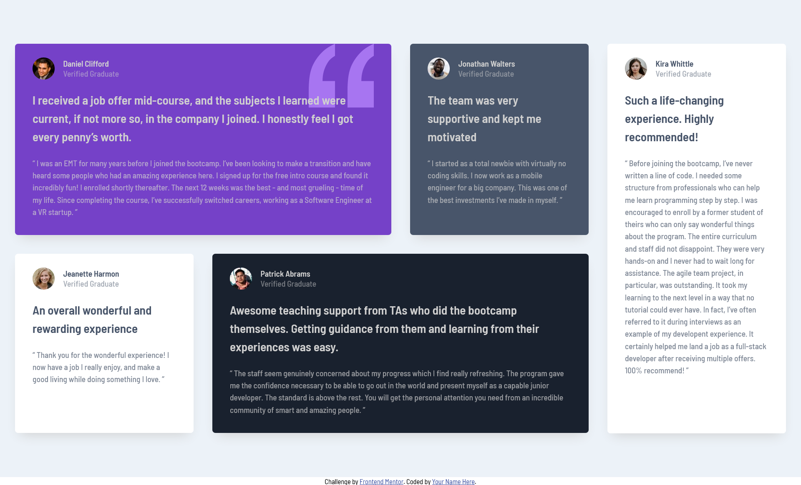

# Frontend Mentor - Testimonials grid section solution

This is a solution to the [Testimonials grid section challenge on Frontend Mentor](https://www.frontendmentor.io/challenges/testimonials-grid-section-Nnw6J7Un7). Frontend Mentor challenges help you improve your coding skills by building realistic projects. 

## Table of contents

- [Overview](#overview)
  - [The challenge](#the-challenge)
  - [Screenshot](#screenshot)
  - [Links](#links)
- [My process](#my-process)
  - [Built with](#built-with)
  - [What I learned](#what-i-learned)
  - [Continued development](#continued-development)
  - [Useful resources](#useful-resources)
- [Author](#author)

## Overview

### The challenge

Users should be able to:

- View the optimal layout for the site depending on their device's screen size

### Screenshot

### Links

- Solution URL: [Solution](https://github.com/Elle-ye/Testimonial-Grid-Section)
- Live Site URL: [Live Site](https://elle-ye.github.io/Testimonial-Grid-Section/)

## My process

### Built with

- Semantic HTML5 markup
- CSS custom properties
- Flexbox
- CSS Grid
- Mobile-first workflow

### What I learned

CSS Grid

### Continued development

Continue learning CSS Grid

### Useful resources

- [Kevin Powell's](https://www.youtube.com/watch?v=rg7Fvvl3taU) - He recreated this challenge so I kinda followed along abit when I was struggling with some parts (what caused the confusion with my layout was literally margin:auto). 

## Author

- Website - [Elle-ye](https://github.com/Elle-ye)
- Frontend Mentor - [@yourusername](https://www.frontendmentor.io/profile/Elle-ye)